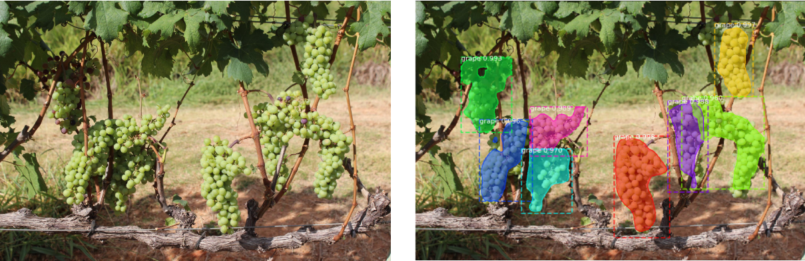

## Grapes Recognition

#### This repository trains a model for Grapes Instance Segmentation in a picture using Mask_RCNN.

 

* Dataset used: [thsant/wgisd](https://zenodo.org/record/3361736#.XcQJVzMzZPY)

* Git for training the model: [Mask_RCNN](https://github.com/matterport/Mask_RCNN)

* Git for augmenting the data: [UjjwalSaxena/Automold--Road-Augmentation-Library](https://github.com/UjjwalSaxena/Automold--Road-Augmentation-Library)

After downloading the WGISD dataset, copy the data folder into the repo/dataset folder.

```python
#To install prerequisites libraries run:
pip install -r requirements.txt

#To augment the dataset and split it into training and validation set run:
python code/augment_split.py

#To train your own model with the augmented dataset run:
python code/train_grapes.py
```

In case of a **StopIteration error** while training the model, it is suggested to install **Keras==2.2.5** and **Tensorflow==1.15.0** according to [this](https://github.com/matterport/Mask_RCNN/issues/1825) git issue.

Jupyter notebook **test_grapes.ipynb**  has been created to visualize the results of the **mask_rcnn_grapes.h5**

Coming soon: 

* Photos

* Code for live recognition / video recognition

* More accurate model
