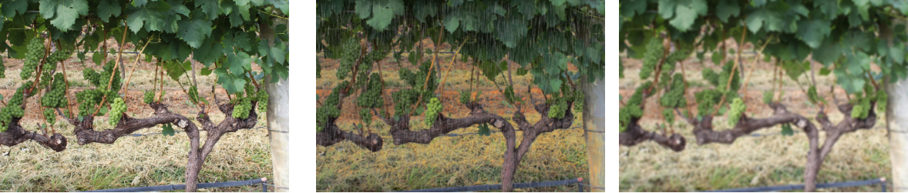

## Grapes Recognition

#### This repository trains a model for Grapes Instance Segmentation in a picture using Mask_RCNN.


* Dataset used: [thsant/wgisd](https://zenodo.org/record/3361736#.XcQJVzMzZPY)

* Git for training the model: [Mask_RCNN](https://github.com/matterport/Mask_RCNN)

* Git for augmenting the data: [UjjwalSaxena/Automold--Road-Augmentation-Library](https://github.com/UjjwalSaxena/Automold--Road-Augmentation-Library)

#### Installation

After downloading the WGISD dataset, copy the **data** folder into the **repo/dataset** folder.

```python
#To install prerequisites libraries run:
pip install -r requirements.txt
```
Grapes recognition, is still an open problem due to the difficulty emerging from varying weather conditions. To eliminate this impediment we choose to augment the dataset:

1. Varying levels of contrast


2. Varying levels of brightness


3. Addition of rain and fog


```python
#To augment the dataset and split it into training and validation set run:
python code/augment_split.py
```

```python
#To train your own model with the augmented dataset run:
python code/train_grapes.py
```

To test your model use the **test_grapes.ipynb**. If you don't want to train your own model, use the pre-trained **mask_rcnn_grapes.h5** in the releases of the repository. Use the **validation folder** to evaluate the model (mAP). Use the **test folder** to test your own images. 

```python
#To predict a downloaded video run:
python /code/visualize_cv2.py video_path

#To predict from your webcam run:
python /code/visualize_cv2.py 0
```

#### Errors

In case of a **StopIteration error** (or other errors from Keras/Tensorflow) while training the model, it is suggested to install **Keras==2.2.5** and **Tensorflow==1.15.0** according to [this](https://github.com/matterport/Mask_RCNN/issues/1825#issuecomment-549767122) git issue.


#### Coming soon: 

* Code for live recognition / video recognition
